# System Context Diagram

## Architecture Overview

```mermaid
graph TB
    User["👤 End User"]
    Browser["🌐 Web Browser"]
    Frontend["⚛️ React Frontend<br/>Vite @ localhost:8085 (local) / 7085 (docker)<br/>(Login, Search, Upload, Edit, Delete)"]
    Backend["🔌 Express Backend<br/>Node.js @ localhost:8086 (local) / 7086 (docker)<br/>(Auth, CRUD, Search API)"]
    Database["🗄️ PostgreSQL<br/>(Users, Prices Tables)"]
    
    User -->|Interacts| Browser
    Browser -->|HTTP/HTTPS| Frontend
    Frontend -->|JWT Token via Authorization Header| Backend
    Backend -->|SQL Queries<br/>Parameterized| Database
    Database -->|Query Results| Backend
    Backend -->|JSON Response| Frontend
    Frontend -->|Display| Browser
```

## Data Flow

1. **User Login/Register** → Frontend sends credentials → Backend validates & generates JWT token
2. **Authenticated Requests** → Frontend attaches JWT in `Authorization: Bearer {token}` header
3. **Backend Processing** → Validates JWT, executes business logic, queries PostgreSQL
4. **Database Operations** → `users` table (authentication), `prices` table (records)
5. **Response** → Backend returns JSON, Frontend renders UI

## Key Features

- **Authentication**: JWT-based with bcrypt password hashing
- **Database**: PostgreSQL with parameterized queries (SQL injection protection)
- **Frontend**: React with TypeScript, state management via Context API
- **Backend**: Express with TypeScript, modular service/route architecture
