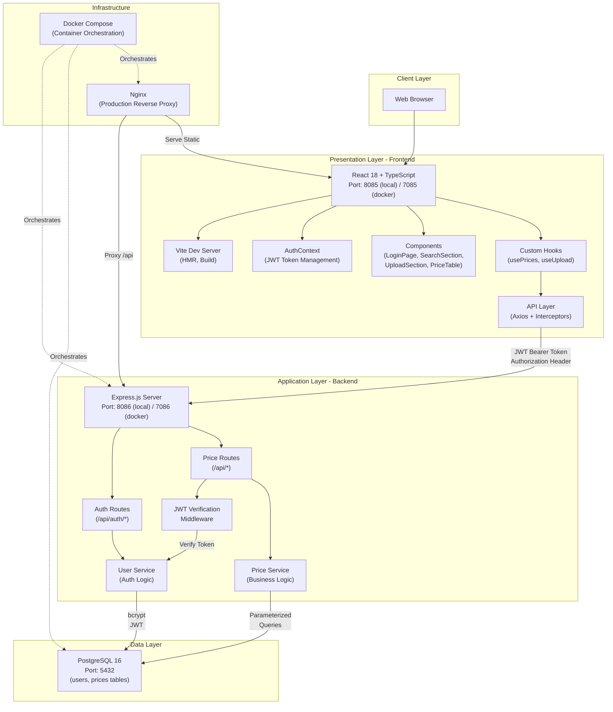
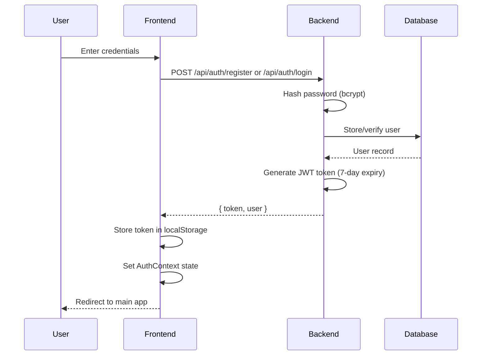
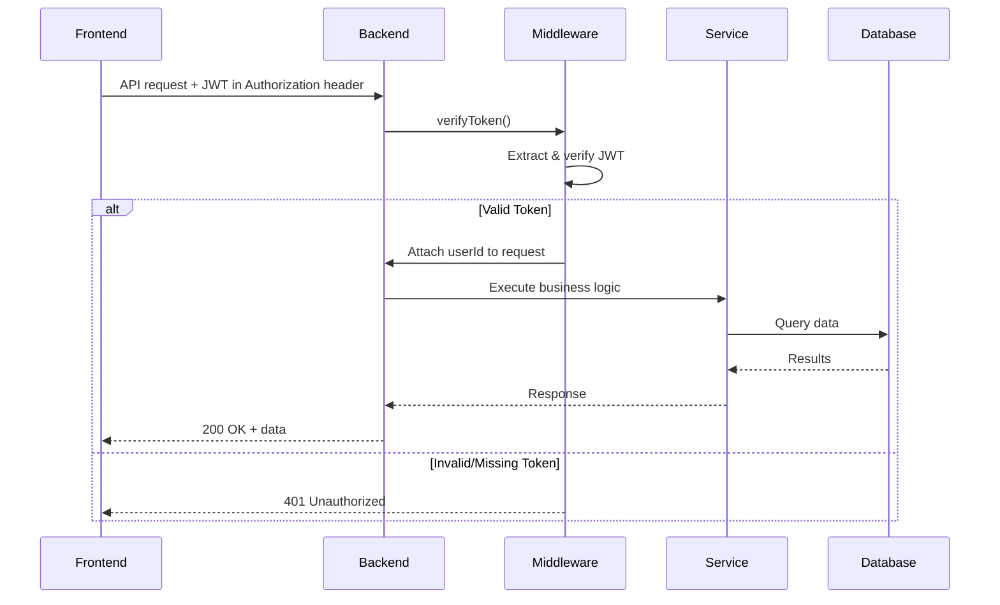

# Solution Architecture

## Overview

The Retail Store Pricing Platform is a full-stack web application designed to manage pricing records across retail stores. It provides secure authentication, CSV bulk upload, advanced search, and CRUD operations for pricing data.

---

## Architecture Diagram



---

## Technology Stack

### Frontend
| Technology | Purpose | Version |
|------------|---------|---------|
| React | UI framework | 18.2+ |
| TypeScript | Type safety | 5.0+ |
| Vite | Build tool & dev server | 5.1+ |
| Axios | HTTP client | 1.6+ |
| React Context API | State management (auth) | Built-in |

### Backend
| Technology | Purpose | Version |
|------------|---------|---------|
| Node.js | Runtime environment | 18+ |
| Express.js | Web framework | 4.18+ |
| TypeScript | Type safety | 5.0+ |
| jsonwebtoken | JWT generation/verification | 9.0+ |
| bcrypt | Password hashing | 6.0+ |
| pg | PostgreSQL client | 8.10+ |
| multer | File upload handling | 1.4.5+ |
| csv-parse | CSV parsing | 5.4+ |

### Database
| Technology | Purpose | Version |
|------------|---------|---------|
| PostgreSQL | Relational database | 16 |

### DevOps
| Technology | Purpose | Version |
|------------|---------|---------|
| Docker | Containerization | Latest |
| Docker Compose | Multi-container orchestration | 3.8 |
| Nginx | Reverse proxy (production) | Alpine |

---

## Application Layers

### 1. Client Layer

**Components:**
- Web browsers (Chrome, Firefox, Safari, Edge)

**Responsibilities:**
- Render UI
- Handle user interactions
- Execute JavaScript

---

### 2. Presentation Layer (Frontend)

**Port:** 8085 (local dev), 7085 (Docker)

**Key Components:**

#### a. Pages
- **LoginPage**: Authentication UI (login/register toggle)

#### b. Components
- **SearchSection**: Search form with filters
- **UploadSection**: CSV file upload interface
- **PriceTable**: Data grid with edit/delete actions
- **EditModal**: Modal for editing records
- **ConfirmDeleteModal**: Confirmation dialog
- **ProtectedRoute**: Route guard component

#### c. State Management
- **AuthContext**: Global authentication state
  - Token storage (localStorage)
  - User information
  - Login/logout methods
  - isAuthenticated flag

#### d. Custom Hooks
- **usePrices**: Price data fetching & management
- **useUpload**: File upload state & logic
- **useAuth**: Auth context consumer

#### e. API Layer
- **authApi.ts**: register(), login()
- **priceApi.ts**: search(), upload(), update(), delete()
- Axios interceptors for automatic JWT attachment

**Build Process:**
- Development: Vite dev server with HMR
- Production: Static build served by Nginx

---

### 3. Application Layer (Backend)

**Port:** 8086 (local), 7086 (Docker)

**Architecture Pattern:** Layered Architecture (Routes → Services → Data Access)

#### a. Routes Layer
Thin HTTP handlers that validate input and delegate to services.

**Auth Routes** (`/api/auth/*`)
- `POST /api/auth/register` - User registration
- `POST /api/auth/login` - User authentication

**Price Routes** (`/api/*`) - Protected by JWT middleware
- `POST /api/upload` - CSV bulk upload
- `GET /api/search` - Advanced search with filters
- `GET /api/records/:id` - Get single record
- `PUT /api/records/:id` - Update record
- `DELETE /api/records/:id` - Delete record

#### b. Middleware Layer
- **verifyToken**: JWT validation middleware
  - Extracts token from Authorization header
  - Verifies signature and expiration
  - Attaches userId/email to request object
  - Returns 401 on invalid/missing token

#### c. Service Layer
Business logic and data access.

**UserService**
- `register()` - Hash password, create user, generate JWT
- `login()` - Verify credentials, generate JWT
- `verifyToken()` - Validate JWT token
- `getUserById()` - Fetch user by ID

**PriceService**
- `search()` - Query with multiple filters
- `upload()` - Parse CSV, validate, bulk insert
- `getById()` - Fetch single record
- `update()` - Update existing record
- `delete()` - Delete record

#### d. Data Access Layer
- PostgreSQL connection pool (pg)
- Parameterized queries (SQL injection protection)
- Transaction support for bulk operations

---

### 4. Data Layer

**Database:** PostgreSQL 16

**Schema:**

#### Users Table
```sql
CREATE TABLE IF NOT EXISTS users (
    id SERIAL PRIMARY KEY,
    email VARCHAR(255) UNIQUE NOT NULL,
    password_hash VARCHAR(255) NOT NULL,
    created_at TIMESTAMP DEFAULT CURRENT_TIMESTAMP,
    updated_at TIMESTAMP DEFAULT CURRENT_TIMESTAMP
);
```

#### Prices Table
```sql
CREATE TABLE IF NOT EXISTS prices (
    id SERIAL PRIMARY KEY,
    store_id INTEGER NOT NULL,
    sku VARCHAR(100) NOT NULL,
    product_name VARCHAR(255) NOT NULL,
    price DECIMAL(10, 2) NOT NULL,
    date DATE NOT NULL,
    created_at TIMESTAMP DEFAULT CURRENT_TIMESTAMP,
    updated_at TIMESTAMP DEFAULT CURRENT_TIMESTAMP
);

CREATE INDEX idx_prices_store_id ON prices(store_id);
CREATE INDEX idx_prices_sku ON prices(sku);
CREATE INDEX idx_prices_date ON prices(date);
```

**Schema Initialization:**
- Auto-initializes on backend startup
- Creates tables if they don't exist
- Creates indexes for query optimization

---

## Security Architecture

### Authentication Flow



### Authorization Flow



### Security Features

1. **Password Security**
   - Bcrypt hashing with 10 salt rounds
   - Never store plaintext passwords
   - Minimum 6 character password requirement

2. **JWT Tokens**
   - Signed with secret key (configurable via JWT_SECRET env var)
   - 7-day expiration
   - Contains userId and email in payload
   - Transmitted via Authorization header (Bearer scheme)

3. **SQL Injection Protection**
   - Parameterized queries only
   - No string concatenation in SQL

4. **CORS Configuration**
   - Configurable allowed origins
   - Default: allow all (should restrict in production)

5. **Route Protection**
   - Public routes: `/api/auth/*`
   - Protected routes: `/api/*` (requires valid JWT)

---

## Data Flow Scenarios

### 1. User Registration & Login

**Steps:**
1. User fills registration form (email, password)
2. Frontend sends POST to `/api/auth/register`
3. Backend validates input (email format, password length)
4. Backend hashes password with bcrypt
5. Backend inserts user into `users` table
6. Backend generates JWT token
7. Backend returns `{ token, user }` to frontend
8. Frontend stores token in localStorage
9. Frontend sets AuthContext state
10. Frontend redirects to main app

### 2. CSV Upload

**Steps:**
1. User selects CSV file in UploadSection
2. Frontend sends multipart/form-data POST to `/api/upload` with JWT
3. Backend verifyToken middleware validates JWT
4. Backend parses CSV (multer → csv-parse)
5. Backend validates rows (required fields, data types)
6. Backend begins transaction
7. Backend bulk inserts into `prices` table
8. Backend commits transaction
9. Backend returns success count
10. Frontend displays success message

### 3. Search with Filters

**Steps:**
1. User enters search criteria (store_id, sku, date range, price range)
2. Frontend sends GET to `/api/search?store_id=1&sku=ABC...` with JWT
3. Backend verifyToken middleware validates JWT
4. Backend PriceService builds dynamic SQL query
5. Backend executes parameterized query with indexes
6. PostgreSQL returns matching rows
7. Backend formats and returns results
8. Frontend displays results in PriceTable
9. User can edit or delete individual records

### 4. Record Edit

**Steps:**
1. User clicks edit on a row, modal opens
2. User modifies product_name and/or price
3. Frontend sends PUT to `/api/records/:id` with JWT and updated data
4. Backend validates JWT and input
5. Backend updates record in database
6. Backend returns updated record
7. Frontend updates local state
8. Frontend closes modal and refreshes table

---

## Deployment Architecture

### Local Development

```
Developer Machine
├── Terminal 1: PostgreSQL (localhost:5432)
├── Terminal 2: Backend (localhost:8086)
└── Terminal 3: Frontend (localhost:8085)
```

**Advantages:**
- Fast hot reload
- Easy debugging
- Direct access to logs

### Docker Compose (Production-like)

```
Docker Host
├── postgres (container)
│   └── Port: 5432
├── backend (container)
│   ├── Port: 7086 (external) → 8080 (internal)
│   └── Internal network: app-network
└── frontend (container)
    ├── Port: 7085 (external) → 80 (internal)
    ├── Nginx serves static files
    ├── Nginx proxies /api → backend:8080
    └── Internal network: app-network
```

**Advantages:**
- Production parity
- Isolated environments
- Easy scaling
- Portable deployment

### Container Details

**Backend Container:**
- Multi-stage build (builder → runtime)
- Builder: Compiles TypeScript
- Runtime: Node.js alpine with production dependencies only
- Runs compiled JavaScript (not ts-node)

**Frontend Container:**
- Multi-stage build (builder → nginx)
- Builder: Vite production build
- Runtime: Nginx alpine serving static files
- Nginx config handles SPA routing and API proxy

---

## Performance Considerations

### Database
- Indexes on frequently queried columns (store_id, sku, date)
- Connection pooling (default: 20 connections)
- Parameterized queries for query plan caching

### Frontend
- Code splitting via Vite
- Lazy loading of components
- Memoization of expensive computations
- Debounced search inputs

### Backend
- Stateless design (horizontal scaling ready)
- JWT verification cached per request
- CSV parsing streamed for large files

---

## Scalability Path

### Short-term (Current)
- Single instance of each service
- Suitable for: < 1000 concurrent users

### Medium-term
- Add load balancer (nginx/HAProxy)
- Horizontal scaling: 3-5 backend instances
- PostgreSQL read replicas
- Redis for session caching
- Suitable for: < 10,000 concurrent users

### Long-term
- Kubernetes orchestration
- Auto-scaling based on CPU/memory
- PostgreSQL cluster (Patroni/Citus)
- CDN for static assets
- Message queue for async operations (RabbitMQ/Kafka)
- Suitable for: > 10,000 concurrent users

---

## Monitoring & Observability

### Recommended Additions

1. **Logging**
   - Winston/Pino for structured logs
   - Centralized logging (ELK stack)

2. **Metrics**
   - Prometheus + Grafana
   - Track: request rate, latency, error rate
   - Database metrics: connection pool, query time

3. **Tracing**
   - OpenTelemetry
   - Distributed tracing across services

4. **Health Checks**
   - `/health` endpoint on backend
   - Database connectivity check
   - Kubernetes liveness/readiness probes

---

## Future Enhancements

1. **Features**
   - Price history tracking
   - Bulk edit operations
   - Export to Excel/PDF
   - Real-time price alerts
   - Multi-tenant support

2. **Technical**
   - GraphQL API alternative
   - WebSocket for real-time updates
   - Redis caching layer
   - Background jobs (Bull/BullMQ)
   - API rate limiting
   - RBAC (role-based access control)

3. **DevOps**
   - CI/CD pipelines (GitHub Actions)
   - Automated testing (Jest, Cypress)
   - Blue-green deployments
   - Infrastructure as Code (Terraform)

---

## Conclusion

This architecture provides a solid foundation for a production-grade pricing management system. The layered approach ensures separation of concerns, the security model protects sensitive data, and the containerized deployment enables easy scaling and maintenance.

For detailed system context and visual diagrams, refer to [context-diagram.md](./context-diagram.md).
